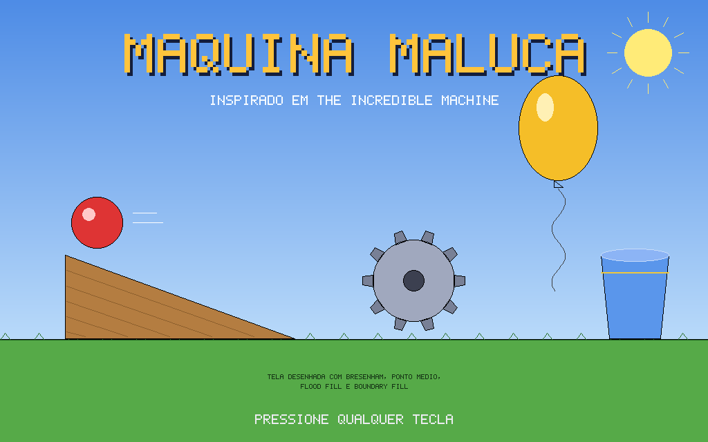
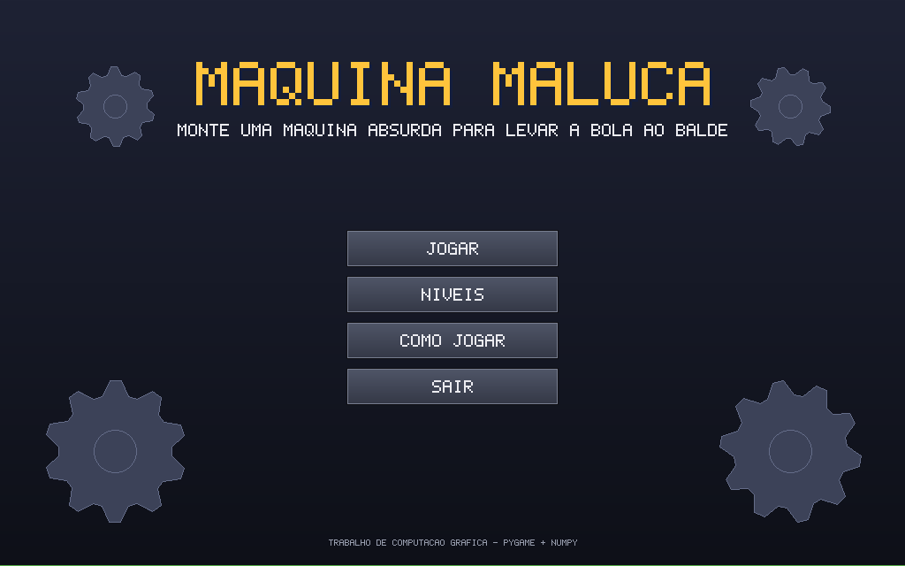
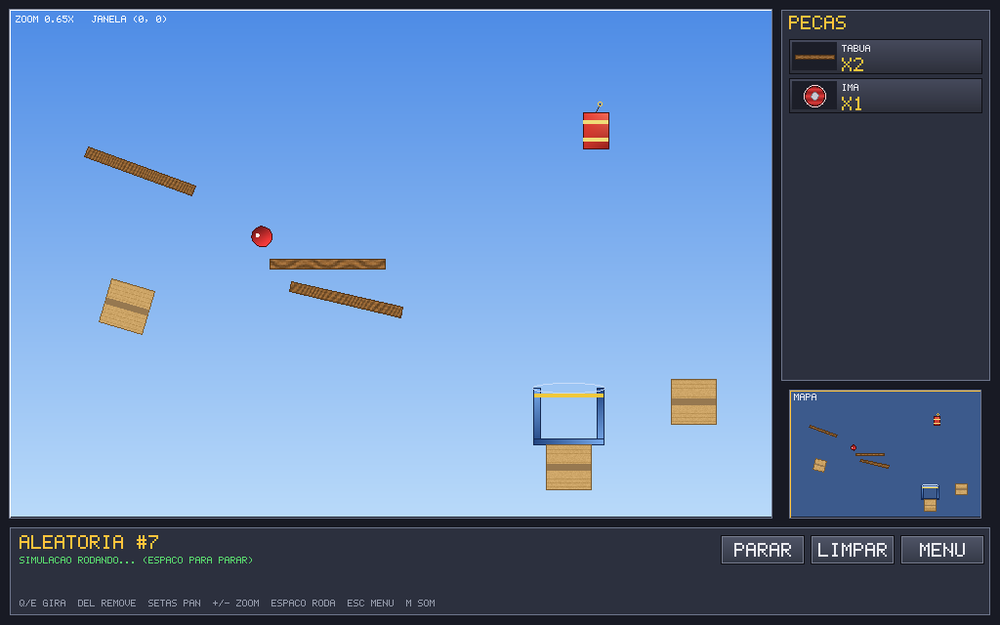
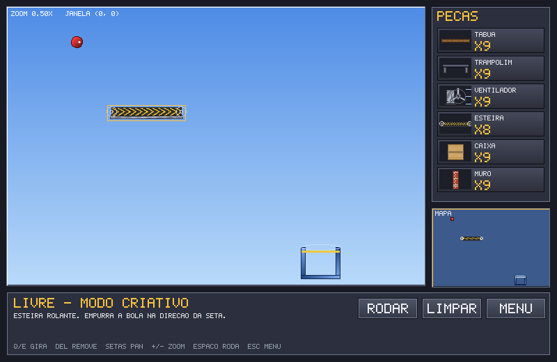

# Máquina Maluca

Jogo arcade 2D de quebra-cabeças inspirado em **The Incredible Machine**, desenvolvido
para a disciplina de Computação Gráfica. O jogador recebe uma bola, um balde e uma caixa
de peças (tábuas, trampolins, ventiladores, esteiras, caixas etc) e precisa montar
uma máquina absurda para levar a bola até o balde.

Toda a imagem é rasterizada "na mão" em uma matriz `numpy` (largura × altura × RGB).
O `pygame` é usado **apenas** para abrir a janela, ler teclado/mouse, carregar as texturas
PNG para matrizes e exibir a matriz final na tela (`pygame.surfarray.blit_array`).
Até o texto é desenhado com uma fonte bitmap própria, pixel a pixel.

| Tela de abertura | Menu |
|---|---|
|  |  |

| Jogo (nível 4) | Modo livre |
|---|---|
|  |  |

## Vídeo

AINDA VOU ADICIONAR O VIDEO NO YOUTUBE

## Como compilar e executar

Requisitos: Python 3.10+ e pip.

```bash
git clone https://github.com/danrockdave/Maquina-Maluca
cd Maquina-Maluca
python -m venv .venv
# Linux/macOS
source .venv/bin/activate
# Windows
.venv\Scripts\activate

pip install -r requirements.txt
python main.py
```

As texturas e os sons já estão em `assets/`. Para regenerá-los (todos são procedurais):

```bash
python -m tools.make_textures   # texturas PNG
python -m tools.make_audio      # trilha sonora e efeitos (WAV)
```

## Como jogar

1. Na tela de abertura, pressione qualquer tecla. No menu escolha **JOGAR** ou **NÍVEIS**.
2. Clique numa peça do painel **PEÇAS** e depois clique na cena para colocá-la.
3. Arraste peças para movê-las. Gire com **Q/E** ou com o botão direito do mouse.
4. Pressione **RODAR** (ou **ESPAÇO**) para ligar a simulação. A física faz o resto.
5. A missão termina quando a bola cai dentro do balde.

| Entrada | Ação |
|---|---|
| Clique esquerdo | Selecionar / colocar / arrastar peça, botões do menu |
| Clique direito | Gira a peça selecionada 15° |
| Roda do mouse | Zoom (escala da janela) na posição do cursor |
| Q / E | Gira a peça selecionada |
| DELETE / BACKSPACE | Devolve a peça ao painel |
| Setas | Move a janela (pan / translação) |
| + / − | Zoom in / out |
| H | Enquadra o mundo inteiro |
| ESPAÇO | Roda / para a simulação |
| ESC | Menu de pausa |
| N | Próximo nível (após vencer) |
| M | Liga / desliga o som |

| F | (Editor) trava / destrava a peça selecionada |
| S | (Editor) salva a fase |

### Modos de jogo

- **Fases 1 a 5** – dificuldade crescente; cada uma apresenta peças novas.
- **Modo livre** – todas as peças à vontade, sem objetivo além de se divertir.
- **Fase aleatória** – `game/generator.py` monta um cenário novo a cada vez (e o menu de
  pausa tem "Sortear outra fase" para trocar sem sair): gera um
  caminho de tábuas entre uma bola e um balde sorteados, **verifica a solução rodando a
  própria física**, acrescenta obstáculos que não quebram a solução e então esconde metade
  das tábuas no inventário do jogador. Toda fase aleatória tem solução garantida, e o
  número da semente aparece no nome para poder ser reproduzida.
- **Editor de fases** – coloque qualquer peça, arraste a bola e o balde, pressione **F** para
  travar as peças que serão cenário (as soltas viram o inventário do jogador) e **S** para
  salvar. As fases ficam em `levels/custom/*.json` e aparecem em *Níveis › Minhas fases*,
  onde o botão **X** (clicado duas vezes, para confirmar) exclui a fase.

## Peças

| Peça | O que faz | Preenchimento |
|---|---|---|
| Bola | Corpo dinâmico com gravidade e rolamento | Gradiente por vértice (24 vértices) |
| Tábua | Rampa rotacionável | Textura de madeira |
| Trampolim | Devolve a bola com mais energia a cada quique | Gradiente por vértice |
| Ventilador | Sopra a bola na direção em que aponta; pás girando | Textura de metal + gradiente nas pás |
| Esteira | Empurra a bola; textura rola continuamente | Textura animada (deslocamento de `u`) |
| Caixa / Muro | Obstáculos sólidos | Texturas de papelão e tijolo |
| Portal | Vem em pares coloridos: a bola entra em um e sai no outro | Gradiente girando + elipse animada |
| Ímã | Campo que atrai a bola e curva sua trajetória | Gradiente + anéis pulsantes (circunferências) |
| Dinamite | Explode ao toque e lança a bola; a explosão é um polígono escalado no tempo | Gradiente (escala animada) |
| Balde | Objetivo | Gradiente + elipse rasterizada na borda |

## Trilha sonora e efeitos

Todo o áudio é sintetizado por código em `tools/make_audio.py` (ondas quadrada, triangular,
senoidal e ruído, envelopes ADSR, varreduras de frequência) — nada foi baixado ou gravado,
então é 100% original. `game/audio.py` toca os WAV com `pygame.mixer`; se não houver placa
de som o jogo roda mudo sem erro.

| Som | Quando toca |
|---|---|
| `music_menu.wav` | Abertura, menu, seleção de nível e ajuda (loop de arpejos) |
| `music_game.wav` | Durante o jogo (loop chiptune com baixo e bateria) |
| `click`, `place`, `remove`, `rotate` | Interação com botões e peças |
| `start`, `stop` | Ligar / parar a simulação |
| `bounce`, `boing` | Impacto da bola (volume proporcional à velocidade); trampolim tem som próprio |
| `wind`, `belt` | Loops ambientes enquanto há ventilador / esteira e a máquina está rodando |
| `boom` | Explosão da dinamite |
| `win`, `lose` | Missão cumprida / bola caiu no vazio |

## Mapeamento dos requisitos

| Requisito | Onde está |
|---|---|
| **a) Set Pixel** | `gfx/raster.py :: set_pixel` – única primitiva usada para escrever na matriz |
| **b) Reta (Bresenham)** | `gfx/raster.py :: draw_line` |
| **b) Circunferência (ponto médio)** | `gfx/raster.py :: draw_circle` |
| **b) Elipse (ponto médio)** | `gfx/raster.py :: draw_ellipse` |
| **Tela de abertura** | `game/scenes.py :: SplashScene._build` – rampa, bola, engrenagem, balão, balde e sol desenhados só com reta/circunferência/elipse |
| **c) Flood Fill** | `gfx/fill.py :: flood_fill` – usado no chão da abertura |
| **c) Boundary Fill** | `gfx/fill.py :: boundary_fill` – usado na bola, rampa, engrenagem, balão e balde da abertura |
| **c) Scanline** | `gfx/fill.py :: fill_polygon` – todos os polígonos do jogo (tabela de arestas, spans pareados) |
| **Gradiente por vértice** | `fill_polygon` com `style['kind'] == 'gradient'` – bola, trampolim, balde, pás do ventilador, botões |
| **h) Textura de imagem** | `fill_polygon` com `style['kind'] == 'texture'` – interpolação de (u, v) por aresta e por span; `gfx/texture.py` carrega PNG → matriz |
| **d) Translação / Rotação / Escala** | `gfx/transform.py` (matrizes 3×3 homogêneas); `game/parts.py :: Part.model_matrix` = T·R·S; arrastar = translação, Q/E = rotação, zoom = escala |
| **e) Animação** | Pás do ventilador (rotação), linhas de vento (translação), esteira (textura rolando), explosão da dinamite (escala), anéis do ímã, portais, engrenagens do menu, bola rolando |
| **f) Janela e Viewport** | `game/camera.py :: Camera` – mapeia janela (mundo) → viewport (dispositivo). Pan e zoom alteram a janela. Duas viewports: cena principal e minimapa; cada botão do painel usa uma mini-viewport |
| **g) Cohen-Sutherland** | `gfx/clipping.py :: cohen_sutherland` – todos os contornos e linhas em coordenadas de mundo passam pelo recorte antes de rasterizar; os polígonos preenchidos são recortados por scanline nos limites da viewport |
| **i) Input** | Teclado e mouse (`game/scenes.py :: PlayScene.handle_event`) |
| **j) Menu interativo** | Menu principal, seleção de nível, ajuda, painel de peças, menu de pausa e tela de vitória (`game/ui.py`, `game/scenes.py`) |
| Fonte bitmap | `gfx/font.py` – texto desenhado com `set_pixel` |
| Áudio (extra) | `tools/make_audio.py` sintetiza a trilha e os efeitos; `game/audio.py` toca via `pygame.mixer` |
| Editor de fases (extra) | `PlayScene(editor=True)` + `game/levels.py :: save_custom_level / load_custom_levels` (JSON) |
| Fases aleatórias (extra) | `game/generator.py` – geração procedural com verificação por simulação |

## Estrutura do repositório

```
maquina_maluca/
├── main.py                # ponto de entrada
├── requirements.txt
├── gfx/                   # biblioteca gráfica própria
│   ├── raster.py          # set_pixel, Bresenham, círculo e elipse (ponto médio)
│   ├── fill.py            # flood fill, boundary fill e scanline (flat/gradiente/textura)
│   ├── clipping.py        # Cohen-Sutherland
│   ├── transform.py       # matrizes de translação, rotação e escala
│   ├── font.py            # fonte bitmap 5x7
│   └── texture.py         # PNG -> matriz numpy
├── game/
│   ├── config.py          # layout da tela e paleta
│   ├── camera.py          # janela/viewport, pan, zoom, recorte
│   ├── parts.py           # peças (polígonos + física + animação)
│   ├── physics.py         # colisão bola × polígono, gravidade
│   ├── levels.py          # níveis, (de)serialização JSON e fases salvas
│   ├── generator.py       # gerador de fases aleatórias com solução garantida
│   ├── ui.py              # botões e painéis
│   ├── scenes.py          # abertura, menu, níveis, ajuda e jogo
│   ├── audio.py           # trilha sonora e efeitos (pygame.mixer)
│   └── app.py             # laço principal
├── tools/
│   ├── make_textures.py   # gerador procedural das texturas (sprites)
│   └── make_audio.py      # sintetizador chiptune (músicas e efeitos)
├── assets/
│   ├── textures/          # texturas PNG
│   └── audio/             # WAV gerados
├── levels/custom/         # fases criadas no editor (JSON)
└── docs/                  # screenshots e documentação
```

## Como o pipeline gráfico funciona

1. Cada peça é um conjunto de polígonos em coordenadas locais (`Part.local_shapes`).
2. O modelo é levado ao mundo por `T(x, y) · R(θ) · S(s)` (`Part.model_matrix`).
3. A câmera converte mundo → dispositivo (`Camera.world_to_device`), aplicando a
   translação e a escala da janela sobre a viewport.
4. O polígono é preenchido por scanline (`fill_polygon`), com cor, gradiente ou
   textura, limitado à viewport; o contorno passa por Cohen-Sutherland e é
   rasterizado com Bresenham.
5. No fim do quadro a matriz inteira é exibida com uma única chamada do pygame.

## Equipe

### Davi Fontenele Meira Marçal

## Créditos

Inspirado em *The Incredible Machine* (Sierra / Dynamix, 1993). Todo o código e todas as
texturas são originais.
# Maquina-Maluca
